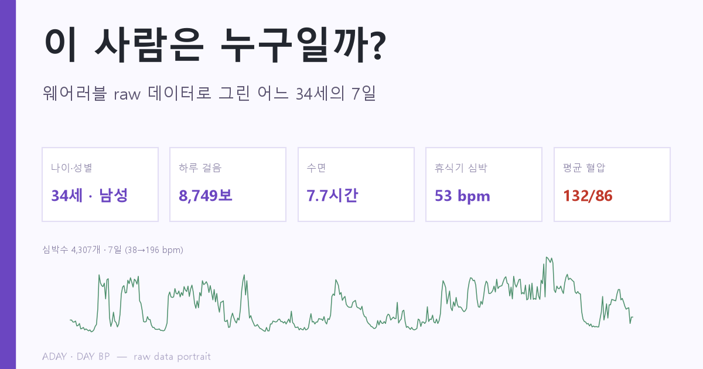

# 이 사람은 누구일까? — raw 데이터 인물 그림책

애플워치 **raw 데이터**(심박 4,307개·활동·수면 등 26개 HealthKit 시트)와 가정용 혈압계 측정 70회만으로 그린, 어느 참여자(가명 ID `8c5a2a78`)의 **7일 초상**입니다.

> 활동적이고 잘 자고 체력 좋은 34세 — 그러나 본인도 모르는 **상승 혈압**(평균 132/86, 측정의 22.9%가 140 초과·미진단)을 웨어러블이 먼저 본다.

- 📖 **그림책 보기:** https://STARG-LEE.github.io/aday-bp-person-portrait/
- 🖼️ **썸네일(직접 경로):** https://STARG-LEE.github.io/aday-bp-person-portrait/thumbnail.png

## 구성
- `index.html` — 그림책 본문(그래프 base64 임베드, 자체완결)
- `thumbnail.png` — 표지/소셜 카드(1200×630)
- `assets/` — 분석 그래프 5종
- `person_summary.json` — 집계 요약 수치

## 데이터
ADAY · DAY BP 수집(애플워치 + OMRON HEM-7156), IRB 심의면제, UUID 가명처리. 본 페이지는 1인 가명 데이터의 집계·시각화이며 분석/그림은 모두 자동 생성되었습니다.
